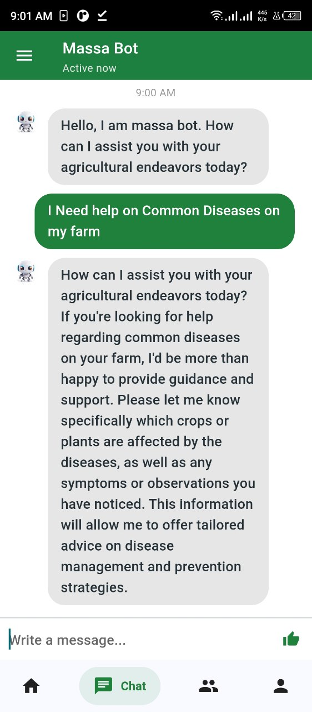

# What is Massa
Massaa is Amharic word with meaning 'Farm'. Our "AI for Agriculture" app offers a solution by providing personalized insights. Through advanced data analytics, we empower farmers to make well-informed decisions about crop selection, timing, resource management, and more. This bridges the information gap, enhances yields, increases profitability, and promotes sustainable farming practices in the region.

## Screenshot Demo

<div style="display: flex; flex-direction: row;">
  
  
  
  
</div>

 
## Features Added Yet:
- Daily Insight 
- Chat With AI
- Recommendation

## Chating With AI
```json
   {"message":" hi "}
    res: {
    "status": true,
    "message": {
        "text": "Hello! How can I assist you today?"
    }
    }
    error: {
    "status": false,
    "message": "The message field is required."
    }

```

## Request Recommendation & Insight to AI
```json
{
  "SoilData": {
    "SoilType": "loam",
    "pHLevel": 1.5,
    "ErosionSusceptibility": 15
  },
  "location": {
    "longtude": 25,
    "latitude": 10,
    "city":"optional"
  },
  "HistoricalCropYields": [
    {
      "CropType": "Wheat",
      "YieldData": [
        {
          "Year": 2020,
          "Yield": 1200
        },
        {
          "Year": 2019,
          "Yield": 1100
        }
      ]
    },
    {
      "CropType": "Corn",
      "YieldData": [
        {
          "Year": 2020,
          "Yield": 800
        },
        {
          "Year": 2019,
          "Yield": 750
        }
      ]
    }
  ],
  "PestAndDiseaseData": {
    "CommonPests": ["Aphids", "Whiteflies"],
    "CommonDiseases": ["Powdery Mildew", "Rust"]
  }
}
```